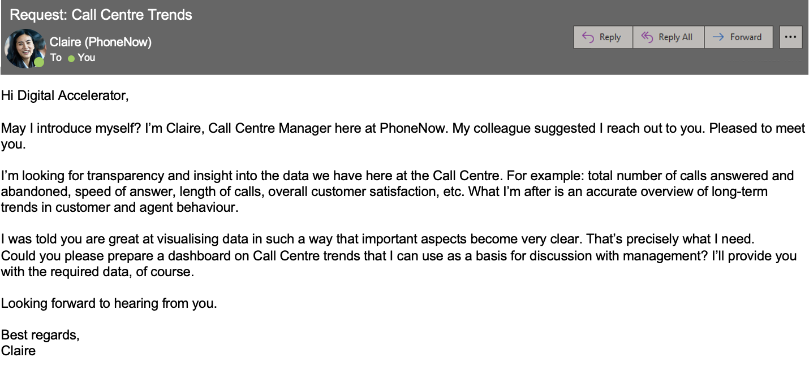

# Call Center Dashboard
This project is part of a 3-part Job Simulation offered by PwC Switzerland through Forage.

## Problem Statement and Brief:
The call centre manager of PhoneNow(A Telecom company) has reached out seeking insights into the call centre and has provided the data:

The task is to create a dashboard in Power BI for the client that reflects all relevant Key Performance Indicators (KPIs) and metrics in the dataset

Here is a view of the dashbaord without any filters:

## Analysis and Insights:
### Key Findings:
- Customer **ratings have decreased by 9%** since January, indicating a potential **decline in overall customer satisfaction**.
- The average call duration has remained consistent at approximately 3 and half minutes per call across the three months.
- The peak hours for incoming calls are observed between 11 AM and 1 PM, with a slight dip around noon (likely due to agents' lunch breaks).
- The call center is performing exceptionally well, with a resolution rate of 89.9%, meaning **9 out of every 10 calls are resolved successfully**.
- The average answer speed is 67.52 seconds, while the answer rate stands at 81.1%, showing a fairly good response rate but with room for improvement in both metrics.

### Recommendations:
- The number of calls drops significantly after 5 PM, with only 14 calls recorded at 6 PM. Given the low volume of calls, consider **ceasing operations at 5 PM** to optimize resource allocation and reduce operational costs.
- While the average answer speed of 68 seconds is fairly good, it can be improved to below 60 seconds, aiming for an optimal 30-second target. Hiring an **additional agent could help** realise this goal and reduce wait times and ultimately improve the overall customer experience.
- Consider **introducing incentive programs** to reward agents with the highest client ratings each month. This could motivate agents to improve their performance and provide exceptional service resulting in a higher average rating for the call centre.
- Since the busiest period for calls is between 11 AM and 1 PM, ensure that staffing levels are highest during these hours to handle the increased call volume efficiently.

## Skills:
Data Visualisation, PowerBI, DAX, Data Analysis

